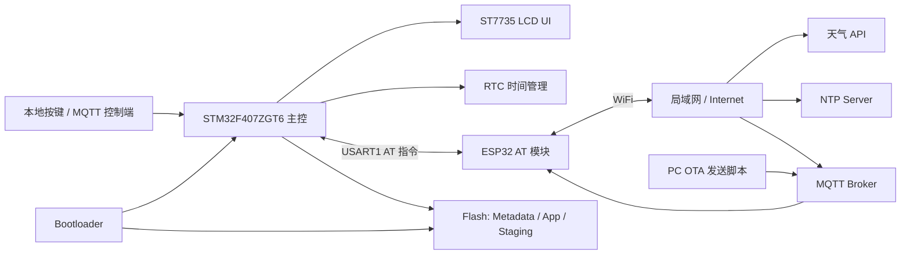

# 基于 STM32F407 的智能天气家居控制中枢

本项目基于 `STM32F407ZGT6 + FreeRTOS + ESP32 AT + MQTT + OTA` 构建，是一个面向智能家居场景的嵌入式 IoT 控制中枢。系统以 STM32F407 作为主控，负责任务调度、UI 显示、RTC 时间管理、天气数据解析、MQTT 指令处理和 OTA 固件写入；ESP32 作为联网通信模块，通过 AT 指令提供 WiFi、HTTP、NTP 和 MQTT 通信能力。

项目最初以天气时钟为基础，后续扩展为具备远程控制、状态上报和在线升级能力的嵌入式控制终端。当前重点解决了 ESP-AT 异步串口消息解复用、FreeRTOS 多任务协作、MQTT 远程指令闭环和 Bootloader OTA 升级流程等工程问题。

## 功能概览

- 天气信息获取、轻量级字段解析与 ST7735 屏幕显示
- RTC 本地时间显示与 NTP 网络校时
- 多页面 UI 显示，支持本地按键和 MQTT 远程切页
- MQTT 指令订阅、状态上报和 ACK 应答
- ESP32 AT 串口异步消息解复用，区分 AT 响应与 MQTT URC 消息
- 基于 MQTT 的 OTA 固件分包传输、CRC32 校验和 Staging 区写入
- Bootloader 校验 Staging 固件、搬运到 App 区并跳转运行

## 系统架构



## 软件设计

### FreeRTOS 多任务

工程使用 FreeRTOS / CMSIS-RTOS2 组织主要业务逻辑，将按键扫描、UI 刷新、RTC 更新时间、ESP32 联网通信等功能拆分为独立任务。UI 页面切换、天气刷新和远程 MQTT 控制通过消息队列解耦，避免外设处理逻辑和界面刷新逻辑直接耦合。

### ESP32 AT 异步消息解复用

ESP32 AT 固件的普通命令响应和异步 URC 消息共用同一个串口，容易出现 HTTP 响应、MQTT 订阅消息和 AT 返回值混在一起的问题。本项目在 `esp32_rx.c` 中实现了常驻串口接收层，使用 UART 中断接收、字节队列、AT 响应队列和 URC 队列对数据进行拆分，使同步 AT 命令和异步 MQTT 消息可以并行处理。

### MQTT 远程控制闭环

设备订阅 MQTT 命令主题后，可以接收远程页面切换、天气刷新和 OTA 控制命令。远程命令会复用本地 UI 消息流，因此物理按键和 MQTT 控制端使用同一套页面控制入口。设备也会通过 ACK / 状态主题反馈执行结果，方便调试和联动。

### OTA 升级机制

OTA 采用 App 接收、Bootloader 搬运的方式。App 通过 MQTT 接收固件分包，写入 Flash Staging 区，并在校验通过后写入 Metadata；重启后 Bootloader 检查 Metadata，校验 Staging 区固件 CRC，擦除 App 区并搬运新固件，最后跳转到 App 运行。

Flash 分区如下：

```text
0x08000000 - 0x0800FFFF  Bootloader
0x08010000 - 0x0801FFFF  OTA metadata
0x08020000 - 0x0807FFFF  Runtime app
0x08080000 - 0x080DFFFF  OTA staging image
0x080E0000 - 0x080FFFFF  Reserved
```

## 工程结构

```text
Core/                 主 App 源码
Core/Src/app_ui.c     ST7735 多页面 UI
Core/Src/esp32_rx.c   ESP32 串口接收与 URC 解复用
Core/Src/esp32_client.c
                      ESP32 AT 指令封装，包含 WiFi / HTTP / NTP / MQTT
Core/Src/weather_parser.c
                      天气字段解析
Core/Src/ota_update.c App 侧 OTA 接收与 Staging 写入
Core/Inc/ota_layout.h OTA Flash 分区定义
Bootloader/           Bootloader 工程与固件搬运逻辑
MDK-ARM/              Keil App 工程
Tools/                PC 辅助工具，例如 MQTT OTA 发送脚本
Docs/                 OTA 协议、烧录流程和调试说明
```

## 开发环境

- MCU：STM32F407ZGT6
- 通信模块：ESP32 AT 固件
- 显示屏：ST7735 LCD
- RTOS：FreeRTOS / CMSIS-RTOS2
- IDE：Keil MDK uVision
- 联网协议：HTTP、NTP、MQTT
- OTA 传输：MQTT 分包下发

## 快速上手

### 1. 配置本地参数

WiFi、天气 API、MQTT Broker 和 Topic 等参数位于本地私有配置文件：

```text
Core/Inc/app_config_private.h
```

该文件包含 WiFi 密码和天气 API Key，不建议提交到公开仓库。公开仓库中建议只保留模板文件，并将私有配置加入 `.gitignore`。

### 2. 编译 Bootloader

使用 Keil 打开：

```text
Bootloader/MDK-ARM/bootloader.uvprojx
```

Bootloader 链接地址为 `0x08000000`，对应 scatter 文件：

```text
Bootloader/MDK-ARM/bootloader.sct
```

### 3. 编译 App

使用 Keil 打开：

```text
MDK-ARM/ZGT6_weatherClock.uvprojx
```

App 链接地址为 `0x08020000`，对应 scatter 文件：

```text
MDK-ARM/ZGT6_weatherClock.sct
```

App 工程需要启用向量表偏移：

```text
USER_VECT_TAB_ADDRESS
VECT_TAB_OFFSET=0x00020000
```

### 4. 首次烧录

首次部署时需要分别烧录 Bootloader 和 App：

```text
Bootloader: Bootloader/MDK-ARM/bootloader/bootloader.hex
App:        MDK-ARM/ZGT6_weatherClock/ZGT6_weatherClock.hex
```

烧录 App 时不要执行全片擦除，否则会擦掉已经写入的 Bootloader。建议使用按扇区擦除或只烧录对应地址范围。

## MQTT 控制命令

默认命令主题：

```text
topic1
```

常用命令：

```text
page_next
page_prev
page_home
weather_refresh
ota_status
ota_abort
ota_reboot
```

ACK 主题：

```text
weather_clock/zgt6_001/ack
```

示例：

```powershell
D:\mosquitto\mosquitto_pub.exe -h 10.59.125.248 -p 1883 -t topic1 -m page_next
```

## OTA 使用

App 编译后生成的 OTA 固件为：

```text
MDK-ARM/ZGT6_weatherClock.bin
```

使用 Python 脚本通过 MQTT 发送固件：

```powershell
python Tools\send_ota_mqtt.py `
  --bin MDK-ARM\ZGT6_weatherClock.bin `
  --host 10.59.125.248 `
  --port 1883 `
  --command-topic topic1 `
  --ack-topic weather_clock/zgt6_001/ack `
  --chunk-size 128 `
  --ack-timeout-sec 60 `
  --version 4
```

当 ACK 主题出现类似结果时，表示 App 侧已经完成 Staging 写入和 CRC 校验：

```text
ota_ready:<size>:<crc32>
```

随后发送重启命令：

```powershell
D:\mosquitto\mosquitto_pub.exe -h 10.59.125.248 -p 1883 -t topic1 -m ota_reboot
```

设备会发布：

```text
ota_rebooting
```

随后复位进入 Bootloader，由 Bootloader 完成固件搬运和 App 跳转。

## 项目亮点

- 使用 FreeRTOS 将 UI、按键、时间和网络通信拆分为多个任务，提升模块边界和可维护性。
- 针对 ESP32 AT 的串口并发接收问题，实现 AT 响应和 MQTT URC 的行级解复用，降低天气 HTTP 响应与 MQTT 异步消息互相干扰的风险。
- 将 MQTT 远程命令映射到本地 UI 消息队列，使本地按键和远程控制复用同一套控制逻辑。
- 设计 Bootloader / Metadata / App / Staging 分区，实现 MQTT OTA 的分包接收、offset 校验、CRC32 校验和 Bootloader 搬运流程。
- 对 FreeRTOS 堆大小、任务栈、MQTT 重连退避和 UART 接收异常恢复等稳定性问题进行了针对性优化。

## 相关文档

- `Docs/ota_bringup.md`：Bootloader / App 首次烧录和 OTA 联调说明
- `Docs/ota_mqtt_protocol.md`：MQTT OTA 协议和 PC 发送脚本说明
- `Bootloader/README.md`：Bootloader 启动流程和 Flash 分区说明

